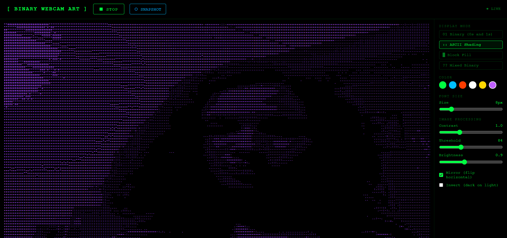

# Binary Webcam Art

Binary Webcam Art is a browser-based webcam visualizer that converts live video into text art in real time.

It supports binary output, ASCII shading, block rendering, and mixed binary noise, with controls for color and image processing.

## Preview



## Features

- Live webcam to text-art rendering in the browser
- Four display modes:
  - Binary: 0/1 characters using thresholding
  - ASCII Shading: brightness-mapped character ramp
  - Block Fill: solid block character rendering
  - Mixed Binary: randomized binary highlights
- Real-time controls:
  - Font size
  - Contrast
  - Threshold
  - Brightness
  - Mirror (horizontal flip)
  - Invert (dark-on-light style)
- Color palette picker for output text
- Snapshot export to JPG
- Responsive layout for desktop and mobile

## Project Structure

- binary_webcam.html: App markup and control panel
- binary_webcam.css: Styles and responsive layout
- binary_webcam.js: Webcam capture, rendering pipeline, controls, and snapshot logic

## Live Demo

https://binary-webcam.vercel.app

## How To Run

This project is static HTML/CSS/JS. No build step is required.

### Option 1: Open directly

1. Open index.html or binary_webcam.html in your browser.
2. Click START CAMERA.
3. Allow camera permission when prompted.

### Option 2: Run on localhost (recommended)

Some browsers handle camera permissions more reliably on localhost.

Python localhost process:

1. Open terminal in project folder.
2. Run:

```powershell
python -m http.server 8000
```

3. Open:

http://localhost:8000/

Node localhost process:

1. Open terminal in project folder.
2. Run:

```powershell
npx serve .
```

3. Open:

http://localhost:3000/

If port 3000 is busy, serve will show a different localhost port in terminal.

## Usage

1. Click START CAMERA.
2. Choose a display mode in the sidebar.
3. Adjust contrast, threshold, brightness, and font size.
4. Toggle Mirror and Invert as needed.
5. Click SNAPSHOT to download a JPG capture of the current text output.
6. Click STOP to end webcam capture.

## Browser Requirements

- A modern browser with getUserMedia support
- Camera permission enabled
- For best compatibility, use Chrome, Edge, or Firefox

## Notes

- If the camera fails to start, check browser permissions and whether another app is using the camera.
- If opened from a file path and permissions are blocked, run on localhost using a local server.

## License

No license file is currently included in this repository.
